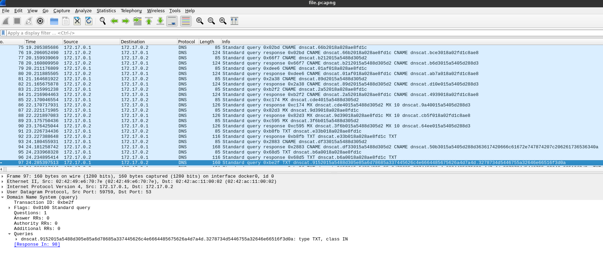

# Forensics

## Broken Files

The challenge provides a `challenge` file of unknown type. I ran `file` against it, but this wasn't helpful.

    $ file ./challenge
    ./challenge: data

I looked at the hex dump with `xxd` and saw a reference to `flag.txt` towards the end, which indicated to me this was some sort of archive format.


    00035530: 0102 1e03 0a00 0900 0000 91a1 1e55 cbbe  .............U..
    00035540: 17b1 2200 0000 1600 0000 0800 1800 0000  ..".............
    00035550: 0000 0100 0000 b481 0000 0000 666c 6167  ............flag
    00035560: 2e74 7874 5554 0500 0362 990e 6375 780b  .txtUT...b..cux.
    00035570: 0001 04e8 0300 0004 e803 0000 504b 0506  ............PK..
    00035580: 0000 0000 0100 0100 4e00 0000 7400 0000  ........N...t...
    00035590: 0000

I tried to `unzip` the `challenge` file, and it printed a warning but continued on to prompt for a password, so this seemed promising.

    Archive:  challenge
    warning [challenge]:  218298 extra bytes at beginning or within zipfile
      (attempting to process anyway)
    [challenge] flag.txt password:

Naively extracting the hash with `zip2john` didn't work because of the missing metadata in the previous warning. Stackoverflow provided a solution to repair the metadata.

    $ zip -FF challenge --out fixed.zip

Now `zip2john` worked as expected.

    $ zip2john fixed.zip > challenge.hashes

I tried to crack the hash with `johntheripper` and the classic `rockyou` wordlist but came up empty. Since the CTF is based in Argentina, I downloaded a Spanish language wordlist and produced the password.

    vanamente

This allowed `flag.txt` to be extracted, revealing the flag.

    flag{_B0rg3S_Th3R43l}

## Professional Zip Cracker

This challenge unsurprisingly provides a `challenge.zip`. `johntheripper` and `rockyou` produced the first password.

    puck02111987

Which extracted `alittlemore.zip`. This was cracked in the same manner, but with a different wordlist of unknown origin, to produce the next password.

    gz

What turned out to be the final archive, `flag.zip`, was more resistant to wordlists and simple brute forcing. Eventually I became curious about the contents, and searching for `pkzip.ps.gz` revealed that it was a part of `pkcrack`, a zip cracking utility that requires a known plaintext file be present in the encrypted archive. Since `pkzip.ps.gz` is included in the encrypted `flag.zip`, and available unencrypted from `pkcrack` itself, I had everything I needed for the final step.

In preparation for running `pkcrack` I downloaded `pkzip.ps.gz` and zipped it up in a new unencrypted zipfile, making sure the compression mode matched afterwards with `unzip -v flag.zip` and `unzip -v new.zip`.

    $ zip new.zip pkzip.ps.gz


    $ unzip -v flag.zip
    Archive:  flag.zip
     Length   Method    Size  Cmpr    Date    Time   CRC-32   Name
    --------  ------  ------- ---- ---------- ----- --------  ----
       74841  Defl:N    74321   1% 09-01-2022 19:05 11958b6d  KP/pkzip.ps.gz
          42  Stored       42   0% 08-29-2022 15:26 5dd7a68f  flag/flag.txt
    --------          -------  ---                            -------
       74883            74363   1%                            2 files

    $ unzip -v new.zip
    Archive:  new.zip
     Length   Method    Size  Cmpr    Date    Time   CRC-32   Name
    --------  ------  ------- ---- ---------- ----- --------  ----
       74841  Defl:N    74321   1% 09-27-2022 16:07 11958b6d  pkzip.ps.gz
    --------          -------  ---                            -------
       74841            74321   1%                            1 file

Then `pkcrack` decrypted the contents of `flag.zip`.

    $ pkcrack -C flag.zip -c KP/pkzip.ps.gz -P new.zip -p pkzip.ps.gz

The flag was revealed.

    flag{YouU_4r3_Th3_R34L_z1p_Cr444ck333r!!}

## My Secret Tunnel

The challenge provides `file.pcapng`. Opened in `wireshark`, it contains some DNS traffic. Given the challenge name and the capture contents, this seemed likely to be DNS tunneling, and the appearance of `dnscat` references confirmed the theory.

I researched `dnscat` and found that the first 9 bytes of each transmission are not part of the payload, the rest is the hex encoded message.

I ultimately overcomplicated this one, and messed about with various `scapy` based python scripts to splice the various `dnscat` messages together and decode the result. In the end I just needed to decode the one message that was notably longer than the others.

<a href="./media/my-secret-tunnel.png">
  
</a>

    $ echo 5a6d78685a337445626c4e6664485675626a4d7a4d.3278734d5446755a32646e66516f3d0a | xxd -r -p
    ZmxhZ3tEblNfdHVubjMzM2xsMTFuZ2dnfQo=

And base64 decode it

    $ echo ZmxhZ3tEblNfdHVubjMzM2xsMTFuZ2dnfQo= | base64 -d
    flag{DnS_tunn333ll11nggg}

# Crypto

## Omelette du fromage Cipher

The challenge provides an encrypted flag.

    hlrv{X1g3ett3_2_34sp_bcae}

Searching for the phrase `Omelette du fromage` brought me to an episode of Dexter's Laboratory in which the phrase is repeated over and over. This felt like a clue that the cipher would use repetition. I tried a Vigenere cipher first. Since the first part of the ciphertext is known to say `flag`, I played around with adding key characters to an online Vigenere solver until I got `flag` to be produced in the plaintext output. Thankfully, that was the full key: `carp`, and the flag was revealed.

    flag{V1g3ner3_2_34sy_maan}

# Web

## Basic

The challenge provides a URL to a domain with a file that simply contains the text `Nothing`. After poking around a bit at headers and cookies, I started on enumeration and checked the classic `/robots.txt`. Sure enough, this led me to `/sup3rsecr3T.txt` which had the flag in a `flag` response header.

    flag{Header_HTTP_Rulessss}

# Prog

## Calculator

The challenge provides a domain and port to connect to with `nc`. Upon connection, you are prompted to solve some simple math problems, but the timeout is too quick to reasonably do so manually. I wrote a script to evaluate each of the provided expressions.

```python
#!/usr/bin/env python3
from pwn import *


# the connection is terminated before a final newline, this prints the buffer contents
context.log_level = "debug"

conn = remote("calculator.ctf.cert.unlp.edu.ar", 15002)

conn.recvuntil(b":\n")

while True:
    line = conn.recvline().strip()

    try:
        result = str(eval(line)).encode("utf-8")
    except Exception:
        print("COMPLETE")
        while(True):
            print(line)
            line = conn.recvline()

    conn.sendline(result)

    print(conn.recvline())
```

I didn't write down the flag :p
